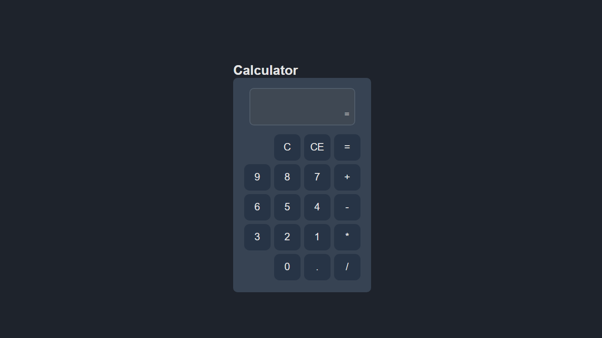

<br />
<p align="center">
 
   

  <h1 align="center">Calculator</h1>

</p>

## Descrição
Este projeto foi desenvolvido para treinar os meus conhecimentos em DOM e Grid Layout.
___

## Demo
Acesse a <a href="https://gustavodias7.github.io/calculator/">demonstração</a> do site.
___

## Techs
- HTML
- CSS
- JavaScript
___

## Download
```bash
$ git clone https://github.com/GustavoDias7/calculator.git
$ cd calculator
$ start index.html
```
___

## Meus Contatos
- <a href="https://www.linkedin.com/in/gustavo-dias-3100211b6/">Linkedin</a>
- <a href="https://www.instagram.com/gugadias__/">Instagram</a>